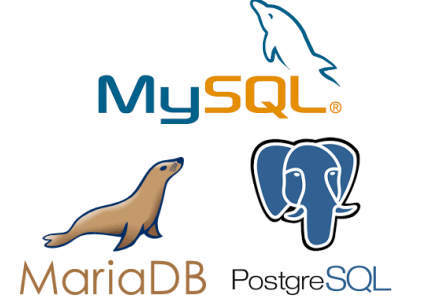
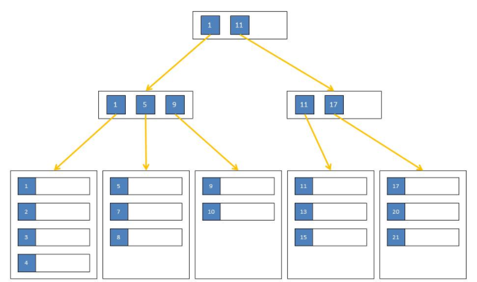
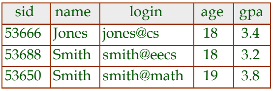
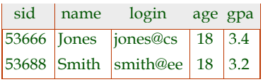
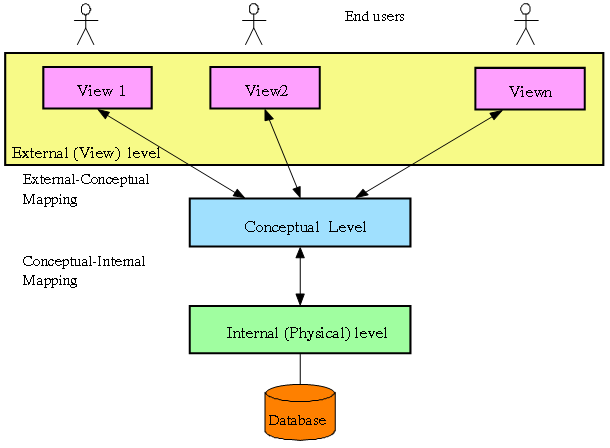

# Data-driven Society
 
# Data-intensive Applications :

* Store data (databases)

* Speed up reads, remembering results (caches)

*  Search data by keywords (search index)

* Send messages to another process asynchronously
(stream application)

* Periodically crunch a large amount of accumulated data
(batch processing)
# Popular SQL Databases
 
## Open Source Databases

* MySQL

* PostgreSQL

* MariaDB

### Commercial Databases

* Oracle 12c

* Microsoft SQL Server

* IBM DB2

# Small data : SQL Lite   
    
SQLite is a relational database management system contained in a C programming library. 
In contrast to many other database management systems, SQLite is not a client–server database engine. 
Rather, it is embedded into the end program.
SQLite is ACID-compliant and implements most of the SQL standard, using a dynamically and weakly typed 
SQL syntax that does not guarantee the domain integrity.
SQLite is a popular choice as embedded database software for local/client storage in application 
software such as web browsers. It is arguably the most widely deployed database engine, 
as it is used today by several widespread browsers, operating systems, and embedded systems (such as mobile phones), 
among others. SQLite has bindings to many programming languages.
# Databases indexing 
Database indexing is a wide topic. Database indexing plays a important role in your query result performance. But like everything this too has a trade off. 
 
## What is indexing    
Indexing is a way of sorting a number of records on multiple fields. Creating an index on a field in a table creates another data structure which holds the field value, and pointer to the record it relates to. This index structure is then sorted, allowing Binary Searches to be performed on it. 
## Data structures used in indexes
SQL Server organizes indexes in a structure known as B+Tree. Many think, B+Trees are binary trees. However, that is not correct. A binary tree is a hierarchical structure organizing nodes (table rows) in a manner that allows searches to be executed extremely efficiently. On the flipside, the binary tree structure is very volatile when it comes to updates, often requiring the entire structure to be rebuilt when a single data point was changed. ([See Wikipedia ](https://en.wikipedia.org/wiki/Binary_tree) for more details.) That makes binary tree a very poor choice when it comes to persisting data on disk.
### The B-Tree  
In 1972, Rudolf Bayer and Ed McCreight, both working at Boeing at the time, were looking for a way to overcome some of the shortfalls of the binary tree. Their solution was the B-Tree. The main difference between a binary tree and a B-Tree is that the latter allows for more than one data point (table row) per node. B-Trees are also balanced, which means that the time it takes to execute a search within this structure is mostly independent of the value to be found.
For a long time it was unclear what the "B" in the name represented. Candidates discussed in public where "Boeing", "Bayer", "Balanced", "Bushy" and others. In 2013, the B-Tree had just turned 40, Ed McCreight revealed in an interview, that they intentionally never published an answer to this question. They were thinking about many of these options themselves at the time and decided to just leave it an open question.
###  The B+Tree 
B-Trees are a lot more efficient than binary trees when it comes to updates, but some operations can still turn out expensive, depending on where the node that will hold the new or updated data lives in the tree. Therefore, another optimization was made to B-Trees to help with this problem. Instead of treating all nodes equal, the new structure has two types of nodes. The lowest level nodes, also called leaf nodes, hold the actual data. All other nodes including the root node only hold the key values and pointers to the next nodes. This type of tree is called a B+Tree and you can see an example below:
 
There are no limitations on the number of key-pointer-pairs or data rows within a node. The only limitation is that all leaf nodes have the same distance from the root node. That means that the work to seek for a particular data point is always the same, no matter what the key value is. It also keeps updates very localized in the tree. I might have to move a few rows to a new node during an update but then I probably only need to change a single parent node to integrate that new node. It is however possible for a single change to affect every level of the tree, but those changes are rare. 
B-Tree and B+Tree are also used on other application like: 
* Databases  
* Filesystems   
* File indexes   
# The DBMS 
A Database Management System (DBMS) is a software package designed to store and manage databases.
* Data independence and efficient access.  
* Reduced application development time.   
* Data integrity and security.  
* Uniform data administration.   
* Concurrent access, recovery from crashes.  
# Data model 
It is an abstract model that organizes elements of data and standardizes how they relate to one another and to properties of the real world entities. For instance, a data model may specify that the data element representing a car be composed of a number of other elements which, in turn, represent the color and size of the car and define its owner.  
The **relational model** of data is the most widely used model today.
 
* Main concept: **relation**, basically a table with rows and columns.
* Every relation has a **schema**, which describes the columns, or fields.
   
## Primary Key / Super Key  
 
A set of fields is a **key** for a relation if :
1. No two distinct tuples can have same values in all key fields, and
2. This is not true for any subset of the key.
*  Part 2 false? A **superkey**.
*  If there’s >1 key for a relation, one of the keys is
chosen (by DBA) to be the **primary key**.  
❖ E.g., **sid** is a key for Students. (What about
name?) The set **{sid, gpa}** is a **superkey**.
## Foreign Keys, Referential Integrity  
❖ **Foreign key** : Set of fields in one relation that is used to "refe" to a tuple in another relation. (Must
correspond to primary key of the second relation.)   
Like a "logical pointer".
❖ E.g. **sid** is a foreign key referring to Students:
* Enrolled(sid: string, cid: string, grade: string)
* If all foreign key constraints are enforced, referential integrity is achieved, i.e., no dangling references.
– Can you name a data model w/o referential integrity?  
◆ Links in HTML!
## Relational Algebra( TO DO ) 

# Data Abstraction in DBMS
Database systems are made-up of complex data structures. To ease the user interaction with database, the developers hide internal irrelevant details from users. This process of hiding irrelevant details from user is called data abstraction.
 
* **Views**: Highest level of data abstraction. This level describes the user interaction with database system i.e how users see the data.
* **Conceptual schema** (logical structure)  This is the middle level of 3-level data abstraction architecture. It describes what data is stored in database.
* **Physical schema**: This is the lowest level of data abstraction. It describes how data is actually stored in database. You can get the complex data structure details at this level.
## Data Independence 
Data independence in DBMS ensures that the data cannot be redefined or reorganized by any of the programs that make use of the data. Refers to the immunity/resistance of user applications to make changes in the definition and organization of data. Each higher level of the data architecture is immune to changes of the next level of the architecture. 
* **Logical data independence**: Protection from changes in logical structure of data.

* **Physical data independence**: Protection from changes in physical structure of data.    
☛ One of the most important benefits of using a DBMS!  
# Conccurency control 
It ensures that database transactions are performed concurrently without violating the data integrity of the respective databases. Thus concurrency control is an essential element for correctness in any system where two database transactions or more, executed with time overlap, can access the same data, e.g., virtually in any general-purpose database system. Consequently, a vast body of related research has been accumulated since database systems emerged in the early 1970s. 
## Scheduling conncurent transactions  
DBMS ensures that execution of {T1, ... , Tn} is equivalent to some *serial* execution T1’ ... Tn’.
* Before reading/writing an object, a transaction requests
a lock on the object, and waits till the DBMS gives it the
lock. All locks are released at the end of the
transaction. (**Strict 2PL locking protocol**)
* **Idea**: If an action of Ti (say, writing X) affects Tj (which
perhaps reads X), one of them, say Ti, will obtain the
lock on X first and Tj is forced to wait until Ti completes;
this effectively orders the transactions.
* What if Tj already has a lock on Y and Ti later requests a
lock on Y? (**Deadlock!**) Ti or Tj is **aborted** and restarted! 

