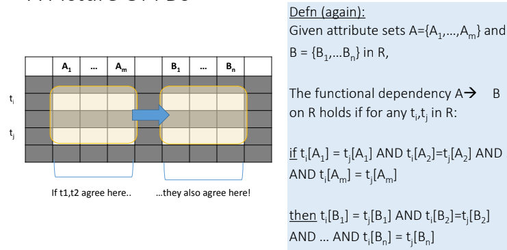
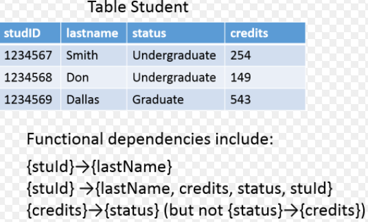

# Functional Dependencies 
## Definition 
 
## Extended definition 
 
### Example of functional dependencies 
 
## FDs for Relational Schema Design

• High-level idea: why do we care about FDs?  
1. Start with some relational schema  
2. Model its functional dependencies (FDs)  
3. Use these to design a better schema
        1. One which minimizes the possibility of anomalies
## Functional Dependencies as Constraints 
 
A **functional dependency** is a form of **constraint** 
• Holds on some instances not others.
• Part of the schema, helps define a valid
instance. 
You can check if an FD is violated by examining a single instance; 
• However, you cannot prove that an FD is part of the schema byexamining a single instance.
• This would require checking every valid instance

Note: The FD {Course} -> {Room}  holds on this instance     
However, cannot prove that the FD {Course} -> {Room} is part of the schema
## Finding functional dependencies  

#### The Splitting/Combining Rule  
Recall that in "Functional Dependencies" we defined the FD:
A1A2…An → B1B2..Bm
to be a shorthand for the set of FD's:

A1A2...An → B1    
A1A2...An → B2
       . . .
A1A2...An → Bm
That is, we may split attributes on the right side so that only one attribute appears on the right of each FD. 
Similarly, we can replace a collection of FD's with a common left side by a single FD with the same left side and all
 the right sides combined into one set of attributes. In either event, the new set of FD's is equivalent to the old. 
The equivalence noted above can be used in two ways.

●  We can replace a FD  A1A2. . .An → B1B2 . . . Bm  by a set 
of FD's  A1A2 . . . An → Bi for i = 1,2,. . . , m. This transformation we call the splitting rule.

●  We can replace a set of FD's A1A2 … An  → Bi for i = 1,2, . . . , m by the 
single FD A1A2. . . An → B1B2 . . Bm. We call this transformation the combining rule. 

For instance, we mentioned in "Functional Dependencies" example, how the set of FD's:

title year → length
title year → filmType
title year → studioName

is equivalent to the single FD:

title year → length filmType studioName

One might imagine that splitting could be applied to the left sides of FD's as well as to right sides.
However, there is no splitting rule for left sides, as the following example shows.

Example : Consider one of the FD's such as:

title year → length

for the relation Movies in "Functional Dependencies" example, If we try to split the left side into

title → length
year → length

then we get two false FD's. That is, title does not functionally determine length, since there can be two movies with the same title (e.g., King Kong)
 but of different lengths. Likewise, year does not functionally determine length, because there are definitely movies of different lengths made in any one year.
 #### Reduction/Trivial 
 A FD  A1A2 . . . An → B is said to be trivial if B is one of the A's. For instance,
title year → title
is a trivial FD.

Every trivial FD holds in every relation, since it says that "two tuples that agree in all of A1, A2, . . . , An agree in one of them". 
Thus, we may assume any trivial FD, without having to justify it on the basis of what FD's are declared for the relation.

In our original definition of FD's, we did not allow a FD to be trivial. However, there is no harm in including them, 
since they are always true, and they sometimes make the statement of rules simpler. 

When we allow trivial FD's, then we also allow (as shorthands) FD's in which some of the attributes on the right are also on the left.
 We say that a FD  A1A2...An → B1B2...Bm is

●  Trivial if the B's are a subset of the A's.
●  Nontrivial if at least one of the B's is not among the A's.
●  Completely nontrivial if none of the B's is also one of the A's.

Thus
title year → year length
is nontrivial, but not completely nontrivial. By removing year from the right side we would get a completely nontrivial FD.
We can always remove from the right side of a FD those attributes that appear on the left. That is:
The FD  A1A2 . . . An → B1B2 ... Bm is equivalent to
A1A2An → C1C2Ck
where the C's are all those B's that are not also A's.
We call this rule, illustrated in the following figure, the trivial-dependency rule.
## Transitive Closure 

 
 
 
 
 
